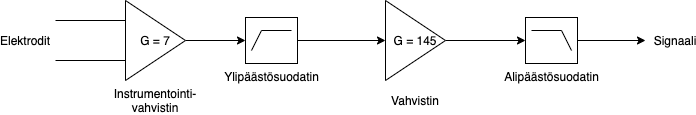
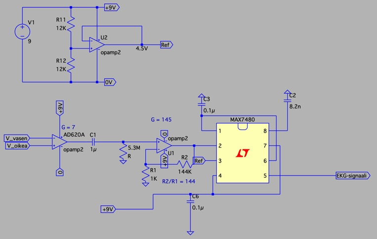
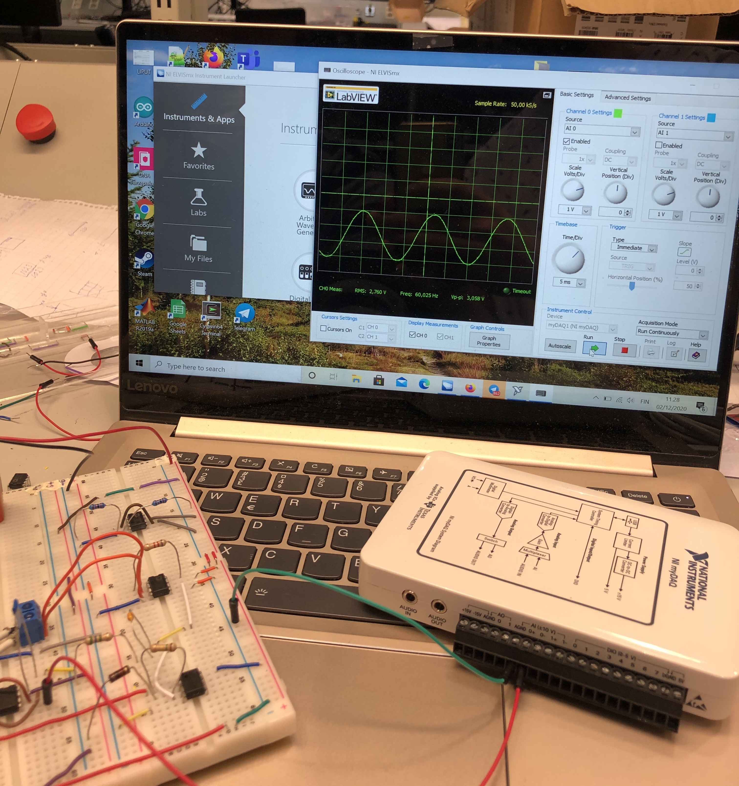

# EKG-projekti
Elektroniikkapaja, Aalto-yliopisto

Elektrokardiogrammi (EKG) eli sydänsähkökäyrä on potilaan sydämen sähköistä toimintaa
kuvaava käyrä. Elektrokardiogrammilaitteella pystyy monitoroida koehenkilön sydämen toimintaa. Käyrän avulla saadaan ideaalitilanteessa tarkkaa
tietoa koehenkilön sydämen tilasta, esimerkiksi mittaamalla pulssi ja diagnosoiden useita
erilaisia sydänvaivoja. Laitetta käytetään yleisesti sairaaloissa ja ensihoidossa.
Elektrokardiogrammilaite mittaa sydämen sähköistä toimintaa kehoon
kiinnitettävien elektrodien avulla. Elektodeja voi olla kaksi tai usempia, muun muassa
rintaan, käsiin ja jalkoihin kiinnitettyinä. Elektrodeilla saadut signaalit prosessoidaan ja suodatetaan
häiriöistä EKG-laitteessa. Sydämestä saatavan signaalin amplitudi on välillä 0.5 mV ja 5 mV
ja sen taajuus välillä 0.05 - 100 Hz. Potilaan hengitys ja liike aiheuttavat piiriin matalilla taajuuksilla olevia
häiriöitä. 

Tarkempi raportti laitteesta on tässä kansiossa.

###### Kuva 1. Projektin lohkokaavio

###### Kuva 2. Projektin piirikaavio

###### Kuva 3. Projektin lopullinen tila*
